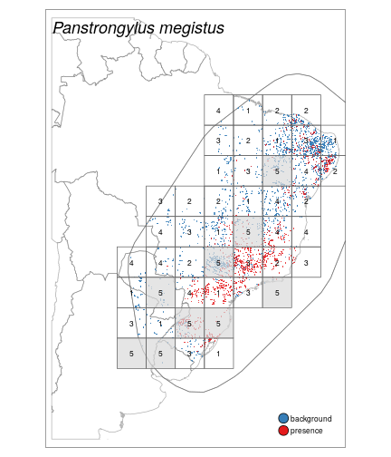
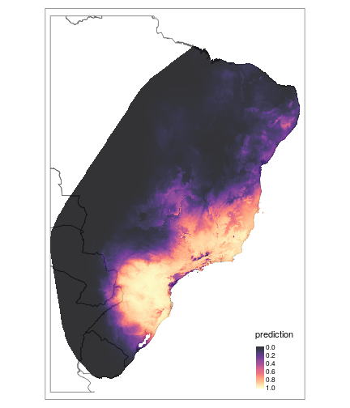
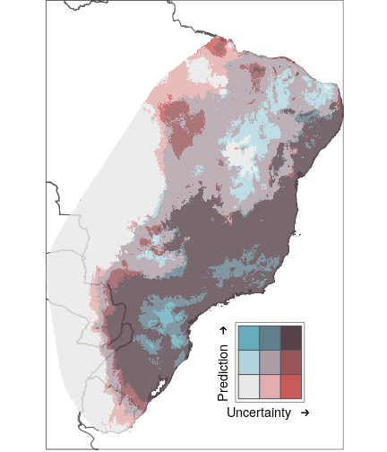

# Species distribution models of chagas vectors

This folder contains code used to fit species ditribution models for chagas vectors.

**Disclaimer**: The analysis is not reproducible as it relies on
a specific location of covariate layers and some confidential data that
could not be made public. Therefore, we provide here code that demonstrates the
workflow and uses freely available data only. Note: the folder structure is
described further below after the exemplary analysis.

---
title: Exemplary Workflow
author: Andreas Bender
date: '2020-05-08'
output:
  html_document:
    toc: true
    toc_float:
      collapsed: true
      smooth_scroll: false
    toc_depth: 4
    self_contained: true
---


This document illustrates the workflow presented in [Bender, Python, Lindsay, et al. (2019)](https://www.biorxiv.org/content/10.1101/738310v1). Note that full details are given in the manuscript and
this code repository. However, as the full data and covariate layers could not be shared, this demo provides a reproducible example with freely available data.
Results based on this data should not differ too much from published results.


```r
devtools::load_all("../mastergrids")
devtools::load_all("../tcruziutils")
# tidyverse
library(dplyr)
library(purrr)
# viz
library(ggplot2)
theme_set(theme_bw())
# modeling
library(scam)

# defaults
# this is just the maximum extent of the endemic zone
# used to crop environmental variables, etc.
extent_tcruzi   <- tcruziutils::extent_tcruzi
countries <- readRDS("../preprocessing/countries.Rds")
# colors
Set1   <- RColorBrewer::brewer.pal(9, "Set1")
```


## Data Import
- In the publication we used the data from
[Ceccarelli, Balsalobre, Medone, et al. (2018)](https://www.nature.com/articles/sdata201871) and some additional data (but not much). The former is openly available (there is a download link for an EXCEL file)
- After download, the file was converted to `.csv` file.
- Some additional preprocessing is performed afterwards


```r
presence_vector <- readr::read_csv(
    file = "SciDataData_CitationCeccarellietal_2018.csv",
    na = c("", " ", "NR", "NA")) %>%
  mutate(
    area = 25L, # analysis will be performed at 5x5 square km resolution
    Start_year = as.integer(substr(year, 1L, 4L)),
    End_year   = as.integer(substr(year, 6L, 9L))) %>%
  rename("reference" = "associatedReferences") %>%
  mutate(
    Public_year = as.integer(stringr::str_extract(.data$reference, "[0-9]{4}")),
    Public_year = ifelse(Public_year > 2018L, NA, Public_year),
    End_year    = ifelse(is.na(End_year), Start_year, End_year)) %>%
  select(scientificName, Start_year, End_year, Public_year, area,
    individualCount, starts_with("decimal"), habitat, reference) %>%
  rename(
    species    = scientificName,
    Latitude   = decimalLatitude,
    Longitude  = decimalLongitude,
    n_observed = individualCount) %>%
  rename_all(~tolower(sub(" ", "_", .))) %>%
  select(-reference)
```
- imputation of the "year" variable if missing


```r
presence_vector <- presence_vector %>%
  rename_all(tolower) %>%
  filter(!(is.na(start_year) & is.na(public_year))) %>%
  filter(start_year <= end_year | is.na(start_year) | is.na(end_year)) %>%
  filter(start_year <= public_year | is.na(start_year) | is.na(public_year)) %>%
  filter(start_year >= 2000 | is.na(start_year)) %>%
  filter(public_year >= 2000 | is.na(public_year)) %>%
  filter(end_year <= public_year | is.na(end_year) | is.na(public_year)) %>%
  mutate(
    imputed = is.na(start_year),
    id      = row_number())
# impute start end year
lm_start <- scam(start_year ~  s(public_year, bs = "mpi"),
  data = presence_vector)
lm_end <- scam(end_year ~ s(start_year, bs = "mpi") +
  s(I(public_year - start_year), bs = "mpi"), data = presence_vector)
presence_vector <- presence_vector %>%
  mutate(start_year = ifelse(is.na(start_year),
    as.integer(floor(predict (lm_start, .))), start_year)) %>%
  mutate(end_year = ifelse(is.na(end_year),
    as.integer(ceiling(predict(lm_end, .))), end_year)) %>%
  # few imputed end year larger than public year
  mutate(end_year = pmin(end_year, public_year))  %>%
  # set end_year to start year if still na (not imputed b/c public year = NA)
  mutate(end_year = if_else(is.na(end_year), start_year, end_year))
```
- remove observations before 2000


```r
presence_vector <- presence_vector %>%
  filter(start_year >= 2000)
```


## Adding spatial/environmental covariates to data set
- in the publication we used raster files available from Servers of
the [Malaria Atlas Project ](https://malariaatlas.org/)
- the environmental variables were extracted for each observation based
on (imputed) year of observation
- here, we use the `raster::getData()` function to obtain the
environmental covariates (we use the same covariate layers for all years)


```r
covs <- raster::getData("worldclim", var = "bio", res = 5)[[1:19]]
env_grids <- raster::crop(covs, extent_tcruzi)
# combine presence + covariate data
covs_ex <- raster::extract(env_grids, as_spatial(presence_vector))
presence_vector <- cbind(presence_vector, covs_ex)
```

## Workflow for one species
The procedure below was iterated over all species (with enough observations) and
consists of the following steps:

1. Create presence/background column for the species of interest
(here `Panstrongylus megistus`)
2. Split data into
  - "training/test" (using spatial blocks/spatial CV), used later for model selection (folds 1-4) and to asses the models "extrapolation performance"
  - "evaluation" (random subsample), used later to asses the models "interpolation performance"
3. The spatial blocks/spatial CV is set up using function
`get_sp_folds` which is a wrapper around the package [**`blockCV`**](https://github.com/rvalavi/blockCV) ([Valavi, Elith, Lahoz-Monfort, et al., 2018](https://besjournals.onlinelibrary.wiley.com/doi/full/10.1111/2041-210X.13107))

4. Fit the model on "training data" (spatial folds 1-4). Here, for illustration, there is no model selection of different models/settings

5. Asses the models performance on data not used during model selection/fit

### 1. Create presence/background dummy

```r
presence_vector <- presence_vector %>%
  mutate(presence = 1L * (species == "Panstrongylus megistus"))
table(presence_vector$presence)
```

```
##
##     0     1
## 13412  1184
```

### 2. Split data

```r
it_pv <- presence_vector %>%
  rsample::initial_split(strata = "species", prop = 4 / 5)
# evaluation data (only used at the very end for "interpolation error" estimate
evaluation_df <- rsample::testing(it_pv)
# train test is split in 5 spatial folds
train_test_df <- rsample::training(it_pv)
```

### 3. Create spatial folds

```r
sp_tt <- as_spatial(train_test_df)
projection(env_grids) <- projection(sp_tt)
raster::crs(env_grids) <- raster::crs(sp_tt)
sp_fold_pans_meg <- get_sp_folds(
  data        = sp_tt,
  species     = "Panstrongylus megistus",
  mask        = env_grids,
  species_var = "species",
  n_blocks    = 50,# number of blocks
  k           = 5, # number of folds
  width       = 5, # width of extended hull (outside of observed )
  calc_range  = FALSE)
```

```
## The best folds was in iteration 77:
##   train_0 train_1 test_0 test_1
## 1    2537     770    792    180
## 2    2841     782    488    168
## 3    2463     690    866    260
## 4    2749     794    580    156
## 5    2726     764    603    186
```

```r
# visual depiction of spatial folds + presence/background
# within extended hull
tmap_cv(
  sp_fold_pans_meg,
  countries = countries)
```



### 4. Fit the model
- In the paper we run a CV for different model specifications on folds 1 - 4
(fit on 3 folds, evaluation on 4th fold)
- best setting/modell w.r.t. average performance for the 4 CV runs is then
refit on folds 1-4 and evaluated using data from fold 5 (this is AUC value
reported in the table)
- this model was also used for evaluation on the random hold-out data (`evaluation_df`) above
- After evaluation the final model was obtained by refitting this model on all
available data (folds 1 -5 and random evaluation data)
- Here we just run one model on folds 1-4, evaluate on fold 5 and hold-out data
and plot the fitted model

#### Fit the GAM

- create `formula` that specifies the linear/additive predictor using
`make_gam_formula`


```r
# create formula
# make_gam_formula: only vars with unique(var) > 20 used
mod_formula <-
  make_gam_formula(
    as.data.frame(sp_fold_pans_meg$train),
    candidates=names(env_grids),
    type = "smooth") %>%
  add_gp() # add gaussian process smooth (see ?mgcv::gp.smooth)
mod_formula
```

```
## presence ~ s(bio1, by = NA) + s(bio2, by = NA) + s(bio3, by = NA) +
##     s(bio4, by = NA) + s(bio5, by = NA) + s(bio6, by = NA) +
##     s(bio7, by = NA) + s(bio8, by = NA) + s(bio9, by = NA) +
##     s(bio10, by = NA) + s(bio11, by = NA) + s(bio12, by = NA) +
##     s(bio13, by = NA) + s(bio14, by = NA) + s(bio15, by = NA) +
##     s(bio16, by = NA) + s(bio17, by = NA) + s(bio18, by = NA) +
##     s(bio19, by = NA) + s(longitude, latitude, bs = "gp")
## <environment: 0x55d02b96f8e8>
```

- Fit the GAM using **`mgcv`**
- `mgcv::bam` could be replaced by `mgcv::gam`, but has less demands w.r.t. to
memory reqiurements and offers significant speed-up, especially with `discrete = TRUE` option ([Wood, Li, Shaddick, et al., 2017](https://doi.org/10.1080/01621459.2016.1195744))
- set `discrete = FALSE` when calling the `predict` function to obtain smoother
predictions


```r
# see mgcv::bam for references
mod <- mgcv::bam(
  formula  = mod_formula,
  data     = as.data.frame(sp_fold_pans_meg$train),
  family   = binomial(),
  method   = "fREML", # fast REML
  discrete = TRUE, # speeds up computation
  gamma    = 2L)
```

### 5. Evaluate the model


```r
prediction_test <- predict(
  mod,
  newdata  = as.data.frame(sp_fold_pans_meg$test),
  type     = "response",
  discrete = FALSE)

prediction_eval_df <- predict(
  mod,
  newdata = evaluation_df,
  type = "response",
  discrete = FALSE
)

# evaluation w.r.t. to extrapolation (i.e. fold 5)
MLmetrics::AUC(prediction_test, sp_fold_pans_meg$test$presence)
```

```
## [1] 0.8262184
```

```r
# evaluation w.r.t. interpolation (i.e. random hold-out data)
MLmetrics::AUC(prediction_eval_df, evaluation_df$presence)
```

```
## [1] 0.95935
```


### 6. Refit model on all data

```r
# extract data points within extended hull of Panstrongylus megistus
df_all <- presence_vector %>%
  as_spatial() %>%
  raster::crop(sp_fold_pans_meg$hull)
# refit model with all data
mod_all <- update(mod, data = as.data.frame(df_all))
```


### 7. Visualize results

- Final prediction:


```r
# newdata with covariate values for each 5x5 pixel within hull of Panstrongylus megistus
env_grids <- env_grids %>%
  raster::crop(sp_fold_pans_meg$hull) %>%
  raster::mask(sp_fold_pans_meg$hull)
ndf <- grid_to_df(env_grids)
# calculate predictions, set discrete = FALSE to obtain smoother predictions
prediction <- predict(mod_all, newdata = ndf, type = "link", discrete = FALSE,
  se = TRUE)
ndf$prediction <- exp(prediction$fit)/(1 + exp(prediction$fit))
# calculate CI
ndf$se <- prediction$se
ci_lower <- prediction$fit - 2*prediction$se
ci_upper <- prediction$fit + 2*prediction$se
ndf$ci_lower <- exp(ci_lower)/(1 + exp(ci_lower))
ndf$ci_upper <- exp(ci_upper)/(1 + exp(ci_upper))
ndf$ci <- ndf$ci_upper - ndf$ci_lower
# retransform df to raster for plotting
pred_raster <- df_to_grid(ndf, env_grids[[1]], "prediction")
tm_shape(raster::crop(countries, raster::extent(sp_fold_pans_meg$hull))) +
  tm_borders() +
  tm_shape(pred_raster) +
  tm_raster(style = "cont", palette = viridis::magma(1e3),
    breaks = seq(0, 1, by = .2), alpha = .8)
```



 - Bivariate map (this is not well implemented in the moment in R), manual hacks
 required (alternatively, could predict upper/lower CI and plot CI alongside prediction)


```r
## Note, this is just for illustration. Specific cut-offs and color palette
# for bivariate maps were used in the publication
# create map + legend
# cut points could be specified
bivar_map <- tm_bivariate(ndf, env_grids[[1]], sp_fold_pans_meg)
# draw figure, x and y control position of legend
tm_bivar_draw(bivar_map, x = .55, y = .05)
```




## References
<a name=bib-bender_modelling_2019></a>[Bender, A, A. Python, S.
Lindsay, et al.](#cite-bender_modelling_2019) (2019). "Modelling
geospatial distributions of the triatomine vectors of Trypanosoma cruzi
in Latin America". En. In: _bioRxiv_, p. 738310. DOI:
[10.1101/738310](https://doi.org/10.1101%2F738310). URL:
[https://www.biorxiv.org/content/10.1101/738310v1](https://www.biorxiv.org/content/10.1101/738310v1)
(visited on Aug. 17, 2019).

<a name=bib-ceccarelli_datatri_2018></a>[Ceccarelli, S, A. Balsalobre,
P. Medone, et al.](#cite-ceccarelli_datatri_2018) (2018). "DataTri, a
database of American triatomine species occurrence". En. In:
_Scientific Data_ 5, p. 180071. ISSN: 2052-4463. DOI:
[10.1038/sdata.2018.71](https://doi.org/10.1038%2Fsdata.2018.71). URL:
[https://www.nature.com/articles/sdata201871](https://www.nature.com/articles/sdata201871)
(visited on Nov. 14, 2018).

<a name=bib-valavi_blockcv_2018></a>[Valavi, R, J. Elith, J. J.
Lahoz-Monfort, et al.](#cite-valavi_blockcv_2018) (2018). "blockCV: An
r package for generating spatially or environmentally separated folds
for k-fold cross-validation of species distribution models". In:
_Methods in Ecology and Evolution_ 0.0. ISSN: 2041-210X. DOI:
[10.1111/2041-210X.13107](https://doi.org/10.1111%2F2041-210X.13107).
URL:
[https://besjournals.onlinelibrary.wiley.com/doi/full/10.1111/2041-210X.13107](https://besjournals.onlinelibrary.wiley.com/doi/full/10.1111/2041-210X.13107)
(visited on Feb. 13, 2019).

<a name=bib-wood_gigadata_2017></a>[Wood, S. N, Z. Li, G. Shaddick, et
al.](#cite-wood_gigadata_2017) (2017). "Generalized Additive Models for
Gigadata: Modeling the U.K. Black Smoke Network Daily Data". In:
_Journal of the American Statistical Association_ 112.519, pp.
1199-1210. ISSN: 0162-1459. DOI:
[10.1080/01621459.2016.1195744](https://doi.org/10.1080%2F01621459.2016.1195744).
URL:
[https://doi.org/10.1080/01621459.2016.1195744](https://doi.org/10.1080/01621459.2016.1195744)
(visited on May. 31, 2018).


## Folder structure
Overview of project files and folders:

- Preliminary notes:
    + The initial steps of this project requiere access to the **`mastergrids`** folder at Maleria Atlas Project and will thus not be fully reproducible

- **`mastergrids`**:
An **`R`** package that facilitates the import of environmental
raster data from the **`mastergrids`** folder at BDI MAP and some
utility functions to transform rasters to data frames and vice versa
(the data import won't work outside of the BDI/without connection to mastergrids). Also contains two functions `grid_to_df` and `df_to_grid` which
convert RasterLayer/RasterBrick object to a data frame and vice versa.

- **`tcruziutils`**: An **`R`** package that facilitates all steps of the
analysis. Most functions are specific to this project and should not be used
for general purpose projects. It can be loaded at the beginning of the script
using `devtools::load_all("<path to project>/tcruziutils")` or installed via
`devtools::install("<path to project>/tcruziutils")` and then loaded as usual
with `library(tcruziutils)`

- **`infection data`** (not included):
Contains data on infection prevalence and presence in vectors and humans
    + **`External vector database`**: Additional data set (compiled by another
    research group that contains *presence only* data on different
    vector species)

- **`endemic zone`** (not included):
Contains a shape-file that defines the endemic zone of the
disease ("mask"). Can be used to crop environmental grid data and other spatial
objects. The spatial extent defined by this mask is stored in the
**`tcruziutils`** package as `raster::extent` and `sp::bbox` objects for
convenience (see `tcruziutils::extent_tcruzi` and `tcruziutils::bbox_tcruzi`).

- **`polygon boundaries`** (not included):
Shapefiles containing polygon boundaries on administrative district levels 1 and 2. Used to extract location/area and polygon information based on the GAUL code. Cropped according to endemic zone and stored as `shp_admin_1.Rds` and `shp_admin_2.Rds` in the **`preprocessing`** folder

- **`preprocessing`**:
This folder contains the main pre-processing scripts and stores the pre-processed data sets that will be used for modeling

    + `import.R`: Initial data import of the presence/prevalence. For
    observations recorded on a polygon level, also adds the centroid
    and area information of the respective polygon to the data (see function
    `add_spat_dat` in **`tcruziutils`** package)

    + `prep-for-modeling.Rmd`: Builds on the `import.R` script and pre-processes the initially imported data for modeling purposes. This includes:
      - application of inclusion/exclusion criteria
      - imputation of (some) missing data
      - addition of covariate layers to the observed presence/absence data
      (based on coordinates; see `raster::extract` and
      `tcruziutils::add_grid_data`)
      - Splits the data set in *train*/*test* data (and possibly *evaluation*
      data). Additionally creates block-wise cross-validation scheme,
      stored as `fold` variable in the original data.
      - also produces some additional visualizations (stored in
      `tcruzi/figures` as `pdf` and `png`)


- **`modeling`**:

     - **`vector_occurrence-sdm`**:
     Folder containing Species Distribution Models (SDM) based on presense only data:
     - See README therein
